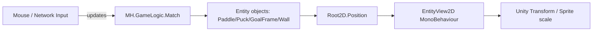

## AirHockey 2D Views Architecture

### Goal
Provide a simple, easy-to-set-up, and expandable Unity “visuals layer” for the existing gameplay model in `Assets/SharedLibrary`:
- `MH.Core.Entity`
- `MH.Core.Root2D` (stores `CustomVector2 Position`)
- `MH.Core.CustomCollider` (e.g., `CircleCollider`, `RectCollider`)

The visuals should be decoupled from simulation and (later) networking, so the rendering logic stays small and reusable.

---

### Core Idea
Keep game state in `SharedLibrary` and bind it to Unity MonoBehaviours using a generic view binder:
- Each view has a `Bind(MH.Core.Entity entity)` method.
- The view reads `Root2D.Position` from the bound entity.
- The view updates the Unity `Transform` every frame.
- Optional: the view auto-scales based on the entity collider size.

---

### Data Flow (simple)

---

### Visual Layer Responsibilities

#### `EntityView2D` (generic base)
Location:
- `Assets/_MH/Scripts/Views/EntityView2D.cs`

Responsibilities:
- Cache `Root2D` from the entity during `Bind`.
- Follow `Root2D.Position` in `Update()` (toggle `followPosition` if needed).
- If `autoScaleFromCollider` is enabled:
  - read `CircleCollider.Radius` to set circle size
  - or read `RectCollider.Width/Height` to set rectangle size
- Prefer using `MoveableObject` if present, because it already syncs a transform from `Root2D.Position`.

#### Typed wrapper views (thin)
These exist mainly for prefab labeling and readability:
- `PaddleView2D`
- `PuckView2D`
- `GoalFrameView2D`
- `WallView2D`

All inherit from `EntityView2D` and contain no extra logic.

---

### Model Additions

Wall model:
- `Assets/SharedLibrary/GameLogic/Wall.cs`
- `Wall : Entity`
- Adds `Root2D` and a `RectCollider`

Match integration:
- `Assets/SharedLibrary/GameLogic/Match.cs`
Adds:
- `public Puck Puck { get; }`
- `public IReadOnlyList<Wall> Walls { get; }`
- default wall creation and initial positions for puck/paddles/goals

---

### Easy Setup: `MatchView2D`
Location:
- `Assets/_MH/Scripts/Views/MatchView2D.cs`

Responsibilities:
- Spawn the correct Unity GameObjects (using optional prefabs).
- Bind each spawned GameObject to its matching `Match` entity via `EntityView2D.Bind`.
- Supports fallback visuals if a prefab is not assigned.

---

### Expected Unity Usage

1. Add/attach `MatchView2D` to a GameObject in the scene.
2. In `MatchView2D`, assign prefabs (optional):
   - `paddlePrefab`, `puckPrefab`, `goalFramePrefab`, `wallPrefab`
3. Create the gameplay match from `MH.GameLogic.Match`.
4. Call `matchView.SetMatch(match)`.

---

### Notes on Prefabs

You already have an existing circle prefab:
- `Assets/_MH/Prefab/MonoEntity.prefab`

This architecture allows you to:
- reuse it for puck/paddle visuals, and
- swap the view scripts to `PuckView2D`/`PaddleView2D`.

For rectangles (goal frame and wall):
- create a simple rectangle prefab with a `SpriteRenderer`,
- then attach `GoalFrameView2D` / `WallView2D`.

---

### Extending the System
To add a new visual type (example: `CenterCircle`):
1. Add a model entity in `SharedLibrary/GameLogic` (create an `Entity` with `Root2D` and a collider).
2. Create a view wrapper inheriting from `EntityView2D`.
3. Update `MatchView2D` to spawn/bind the new view type.

This keeps the architecture simple while staying expandable.

