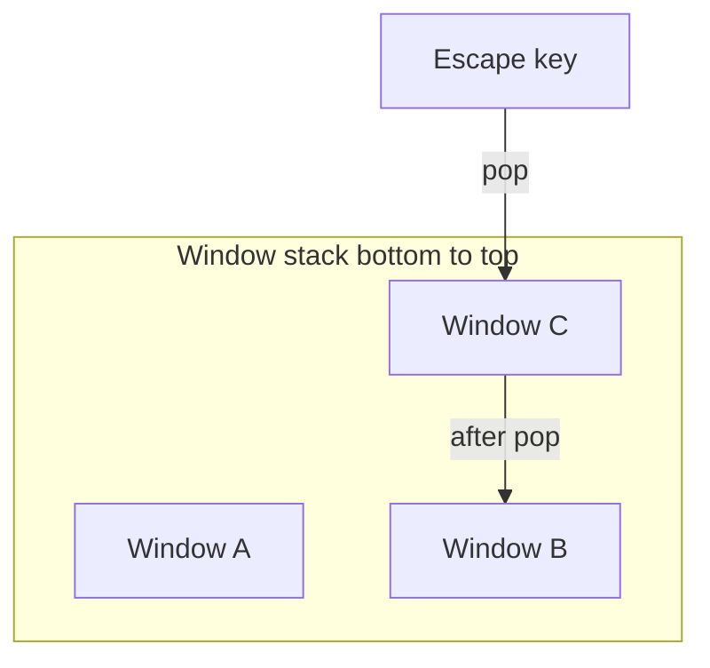

# Basic UI system (architecture)

This document describes the **intended** structure for a small, predictable UI layer: a single entry point (`UIManager`), a common base for screens (`UIView`), and two visual layers—**HUD** and **Window**—with a **stack** for modal-style navigation and **Escape** to go back.

**Code location**: `Assets/_MH/Scripts/UI`  
**Singleton base**: `MonoSingleton<T>` in `Assets/_MH/Scripts/Common/MonoSingleton.cs` — `UIManager` derives from `MonoSingleton<UIManager>` (a `MonoBehaviour`) for a single global access point (`UIManager.Instance`).

**Text**: All UI text uses **TextMesh Pro** (`TMP_Text`), not legacy UI Text — see [`UI_CONVENTIONS.md`](UI_CONVENTIONS.md).

---

## Goals

- **One API** to show or hide any view type: `Show<TView>()`, `Hide<TView>()`.
- **Clear layering**: persistent overlay (HUD) vs. stacked, dismissible UI (Window).
- **Simple navigation**: opening a window pushes onto a stack; **Escape** pops the top window (or closes it), revealing the previous one.
- **Decoupled views**: each `UIView` knows how to show/hide itself; the manager coordinates layers, stack, and input.

---

## Core types

### `UIManager : MonoSingleton<UIManager>`

Central registry and coordinator.

**Inspector setup**

- **`_viewPrefabs`**: assign one prefab per concrete `UIView` type. On **`Start`**, the manager **instantiates** each listed prefab under **`HUDParent`** or **`WindowParent`** (from each prefab’s **`Layer`**). New instances are **`SetActive(false)`** by default. After all are created, any view with **`ShowWhenStart`** enabled on the **`UIView`** component is shown via the same path as **`Show<TView>()`** (including window stack push for **Window** layers).

**Responsibilities**

- Resolve or instantiate views by type `TView : UIView` (see “Lifecycle” below).
- Route `Show<TView>` / `Hide<TView>` to the correct layer (HUD vs Window).
- Maintain the **window stack**: each `Show` of a window pushes; `Hide` or back removes the matching or top entry.
- Handle **Escape** (e.g. in `Update`) and call **pop** on the window stack when appropriate (and optionally ignore when no window is open).

**Public API (conceptual)**

| Method | Role |
|--------|------|
| `Show<TView>()` | Show view `TView`. If it is a **Window**, push onto stack and bring to front. If **HUD**, show without affecting the window stack. |
| `Hide<TView>()` | Hide view `TView`. If it is the top window, pop from stack; otherwise hide without breaking stack order (define policy: usually hide by instance, not only “top”). |

**Optional helpers** (implementation detail): `PopWindow()`, `ClearWindows()`, `Get<TView>()` for cached instances.

---

### `UIView` (base class)

Base for all UI screens/panels (MonoBehaviour or plain class with a reference to a root `GameObject` / `CanvasGroup`, depending on project convention).

**Fields**

- **`_showWhenStart`** (serialized bool): when enabled on a prefab or registered instance, **`UIManager`** shows that view during **`Start`** (after list-based instantiation). Use for default HUD or first menu screen.

**Responsibilities**

- `Show()` — enable root, play show animation if any, refresh bindings.
- `Hide()` — disable root, cleanup subscriptions if needed.

Concrete views (e.g. `MainMenuWindow`, `SettingsWindow`, `ScoreHud`) inherit `UIView` and implement presentation only; **game rules** stay outside or behind thin presenters.

---

## Layers

### HUD

- **Purpose**: always-on or gameplay UI (score, timers, prompts) that should **not** participate in the window back stack.
- **Behavior**: `Show`/`Hide` toggles visibility only; **no push/pop** on Escape.

### Window

- **Purpose**: menus, dialogs, settings—anything that should behave like “screens” or modals.
- **Behavior**: each `Show` **pushes** that window onto a **stack** (same type may appear more than once if you allow it; often you enforce **single instance per type** and replace or ignore duplicates—pick one policy and document it in code).

When the top window is hidden (explicit `Hide` or Escape), **pop** it and show the previous window if any.

---

## Window stack and Escape

- **Escape**: if the window stack is non-empty, **pop the top window** (call its `Hide()` and remove from stack). If the stack is empty, optionally propagate to gameplay or do nothing.
- **Order**: stack order matches **open order**; only the **top** window should typically receive focus/block input unless you add explicit “modal” rules.

HUD elements are **not** on this stack.

---

## Folder layout

| Area | Path |
|------|------|
| UI scripts | `Assets/_MH/Scripts/UI` |
| This doc | `Assets/_MH/Scripts/Doc/UI_SYSTEM_ARCHITECTURE.md` |

Suggested subfolders under `UI` (optional): `Hud/`, `Windows/`, `Core/` (`UIManager`, `UIView`).

---

## Lifecycle and registration (implementation notes)

- **Prefab list (`_viewPrefabs`)**: assign prefabs in the Inspector; at **`Start`**, each is instantiated once under the correct parent, left **inactive**, then **`ShowWhenStart`** is applied so initial visibility matches the checkbox (still using stack rules for windows).
- **Prefab vs scene (other paths)**: you can still **`RegisterPrefab&lt;T&gt;`** (code) or **`RegisterInstance&lt;T&gt;`** (scene object). For those, **`GetOrCreate`** instantiates on first **`Show&lt;T&gt;`** when only a prefab was registered, or reuses a pre-placed instance. Pooling is optional.
- **Duplicate types**: only one instance per concrete `UIView` type in **`_instances`**; a second entry in **`_viewPrefabs`** with the same type is skipped with a console warning.
- **Show&lt;T&gt;**: get or create `T`, call **`ShowInstance`**: `UIView.Show()`, and if `T` is a Window, push to stack.
- **Hide&lt;T&gt;**: call `UIView.Hide()`, remove from stack if it is a Window (by reference or top match).
- **Threading**: UI must run on Unity’s main thread; `MonoSingleton` resolves or creates the manager on first `Instance` access.

---

## Summary

| Concept | Description |
|---------|-------------|
| `UIManager` | `MonoSingleton` hub: `_viewPrefabs` → instantiate at `Start` (inactive), `ShowWhenStart`, `Show<TView>`, `Hide<TView>`, layer routing, window stack, Escape handling. |
| `UIView` | Base with `_showWhenStart`, `Show()` / `Hide()` for each panel. |
| HUD | Non-stacked overlay. |
| Window | Stacked; Escape pops top window. |

This keeps navigation rules in one place (`UIManager`) while each `UIView` stays small and testable.
