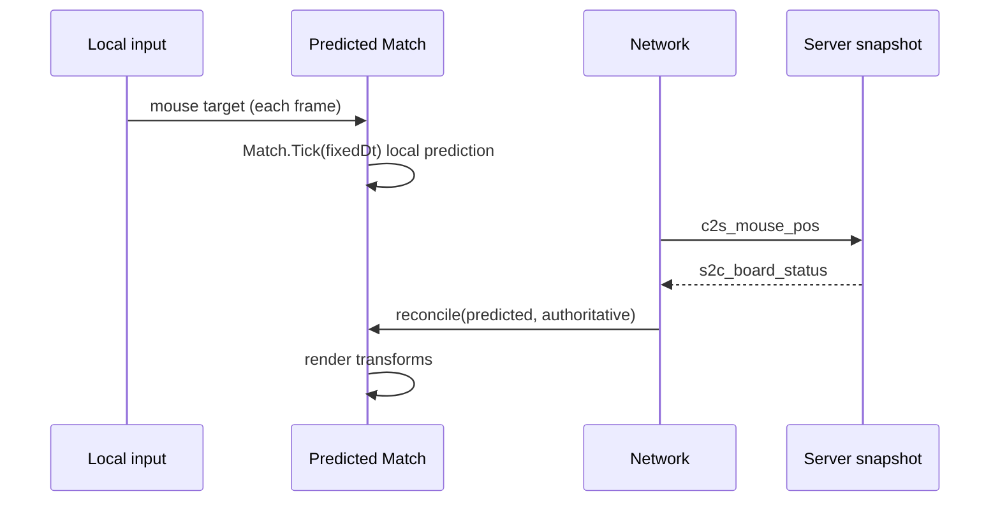

# Client prediction implementation plan

This document plans **client-side prediction** for puck and paddles, on top of the existing **authoritative snapshot** model described in [MATCH_SYNC_ARCHITECTURE.md](MATCH_SYNC_ARCHITECTURE.md).

## Background (today)

- The server runs `Match.Tick` at **60 Hz** and broadcasts **`s2c_board_status`** (puck position/velocity, both paddle positions).
- The **guest** client sends **`c2s_mouse_pos`**, runs **`Match.Tick`** locally at 60 Hz between snapshots, and **reconciles** when each snapshot arrives. The **host** uses the authoritative `Match` only (no guest-style prediction).

That minimizes divergence but adds **latency**: what the player sees lags behind their input by roughly RTT/2 + snapshot interval.

## Target behavior

1. **On player input** (local mouse / target in world space), the client **updates predicted puck and paddles immediately** so the local player feels responsive.
2. **When a server snapshot arrives**, the client **compares** predicted state to authoritative state and **reconciles** (smooth toward truth or correct and replay), so remote correctness and anti-cheat assumptions stay server-driven.

This is **not** changing authority: the server remains the source of truth; the client only **speculates** between snapshots.

## Terminology

| Term | Meaning |
|------|---------|
| **Prediction** | Client applies the same (or equivalent) rules as the server **locally** using local input, before/without waiting for the next `s2c_board_status`. |
| **Reconciliation** | On snapshot, align client state with server state (snap, blend, or rewind-and-replay). |
| **Local player** | The peer whose input is known immediately on this client (`LocalPlayerIndex` from `s2c_match_found`). |
| **Remote player** | The opponent; their “true” target position is unknown until reflected in snapshots (or a future input relay). |

## Design principles

- **Shared movement rules**: Paddle motion from target (`SetPaddleVelocity` / follow + clamp) must match server math. Prefer **shared code** (same constants from `BoardConfig`, same helper) so prediction does not drift by formula mismatch.
- **Fixed timestep on client for prediction**: Run predicted `Match.Tick(fixedDt)` on the client at **the same rate as the server** (60 Hz) to stay close to authoritative integration. Variable `Update` can accumulate time and step prediction in quanta of `fixedDeltaTime`.
- **Separate “predicted” vs “authoritative” if needed**: Keep a clear distinction in code between transforms used for **rendering after prediction** and values **last confirmed by the server**, to simplify reconciliation and debugging.

## What to predict

### Local paddle (high value, lower risk)

- **Input**: Latest `c2s_mouse_pos` target is known locally.
- **Prediction**: Each predicted tick, apply the same velocity-from-target logic the server uses for **this player’s** paddle only (or run full `Match.Tick` if easier, with remote paddle driven by last-known snapshot target—see below).

### Remote paddle (optional / phased)

- **Without** relaying opponent input, the client only knows remote paddle **positions** from snapshots, not their current mouse target.
- **Minimal approach**: Do not predict remote paddle between snapshots; **interpolate** between last and current snapshot (already improves smoothness without guessing input).
- **Stronger approach**: Extrapolate short-term from last velocity implied by snapshots (error-prone on direction changes).

### Puck (high value, higher risk)

- Puck interacts with **both** paddles and walls. Predicting puck requires either:

  - **Full local `Match.Tick`** with a full local `Match` instance (recommended if CPU budget allows): same collision and integration as server; reconciliation fixes divergence.

  - **Partial heuristics** (not recommended): easy to diverge from server physics.

Recommendation: treat puck prediction as **the same simulation** as the server, stepped on the client with predicted inputs for local paddle and best-available state for remote entities.

## Reconciliation strategies

Choose one primary strategy; you can combine **snap for large error** with **blend for small error**.

### A. Hard snap (simplest)

- On `s2c_board_status`, set puck/paddle state to server values (current behavior).
- **Con**: Reintroduces jitter if applied every packet.

### B. Threshold snap / soft blend

- Compute error (e.g. distance for positions, optional velocity delta).
- If error **< ε**: lerp toward server over a few frames.
- If error **≥ ε**: snap (or teleport puck if catastrophic).

Tune ε per entity (puck vs paddle).

### C. Rewind and replay (most consistent for physics)

- Store a short ring buffer of **inputs + state** keyed by **tick** or **sequence**.
- When a snapshot for tick **T** arrives, restore state at **T**, then re-apply stored local inputs for ticks **T+1 … now**.
- Requires **tick or sequence** in protocol (see below). Best when latency and packet loss make naive snap obvious.

**Suggested path for this project**: implement **B** first (blend + snap threshold), then move to **C** if competitive feel still suffers.

## Protocol considerations (optional but recommended for replay)

Today, snapshots do not carry a **simulation tick** or **input sequence** id. For rewind-replay and latency measurement, consider extending **`s2c_board_status`** (or a side channel packet) with:

- `ServerTick` (monotonic `uint` or `int` incremented each sim step), and/or
- `LastProcessedInputSeq` per player (if you add sequence numbers to `c2s_mouse_pos`).

Keep changes backward-compatible during rollout (feature flag or version field if you already have one).

## Client integration sketch (Unity)

High-level flow:

Concrete tasks:

1. **Instantiate a client-only `Match`** used for prediction (or reuse existing render `Match` with a clear “prediction mode” flag).
2. **Feed local input** into predicted simulation every frame (same as sending `c2s_mouse_pos`).
3. **Step prediction** in `FixedUpdate` (or accumulated fixed time in `Update`) at **60 Hz**.
4. **On snapshot**: merge server puck + both paddle positions/velocities per chosen reconciliation policy.
5. **Host / listen-server**: When the local app is authoritative (`HostGameSession`), **do not** run prediction for gameplay truth; apply local sim from memory as today. Prediction applies to **guest** clients unless you explicitly want cosmetic prediction on host (usually unnecessary).

## Phased implementation

### Phase 0 — Preconditions

- [x] Confirm client can run **`Match.Tick`** with the same `BoardConfig` as the server (shared assembly already; verify no server-only `#if` in tick path).
- [x] Add debug draw or HUD toggles: show error vectors (predicted vs server) for puck and paddles.

### Phase 1 — Predict local paddle only

- [x] On input, drive **local player paddle** in predicted `Match` before snapshot arrives.
- [x] On snapshot, reconcile **local paddle** toward server (blend + threshold).
- [x] Keep puck and remote paddle **snapshot-driven** (current behavior) to validate pipeline.

*Implementation note: the stepping-stone “puck + remote snapshot-only” mode was not kept as a separate build; the same `GameRunner` guest path runs **full** `Match.Tick` (Phase 2) while satisfying Phase 1 input/reconcile behavior for the local paddle.*

### Phase 2 — Full prediction (puck + both paddles)

- [x] Run full **`Match.Tick`** on the client between snapshots.
- [x] For **remote paddle**, until opponent input is available, use **last snapshot position** as initial state each tick, or interpolate between snapshots for their target (document chosen approach).
- [x] Reconcile **all entities** on `s2c_board_status`.

*Remote paddle approach (chosen): each predicted tick, `ApplyPaddleTargetFromWorld(remoteId, snapshotPosition)` using the latest `s2c_board_status` paddle coordinates — no extrapolation between packets.*

### Phase 3 — Polish

- [x] Tune blend times and thresholds; cap maximum correction velocity to avoid visible pops.
  - *Current mitigation: distance thresholds snap large errors in one packet; soft lerp otherwise (`GameRunner` constants). No extra per-frame correction velocity clamp.*
- [ ] Optional: add **server tick** + **input history** and implement **rewind-replay** if needed.
- [x] Update [MATCH_SYNC_ARCHITECTURE.md](MATCH_SYNC_ARCHITECTURE.md) “Notes / follow-ups” to point here once an approach is shipped.

## Risks and testing

- **Determinism drift**: Floating-point order, different collision order, or divergent constants cause needless reconciliation. Mitigate with shared code and fixed dt.
- **Cheating**: Prediction is local only; server remains authoritative; do not trust client positions for scoring.
- **Test matrix**: LAN vs WAN latency, packet loss, host-as-server guest path, high frame rate client (multiple prediction substeps per render frame).

## References

- [MATCH_SYNC_ARCHITECTURE.md](MATCH_SYNC_ARCHITECTURE.md) — current snapshot sync, packets, and responsibilities.
- [NETWORK_LAYER.md](NETWORK_LAYER.md) — transport and dispatcher (if extending packets).
- [HOST_AS_SERVER_IMPLEMENTATION_PLAN.md](HOST_AS_SERVER_IMPLEMENTATION_PLAN.md) — host vs guest; prediction applies primarily to **guest** clients.
