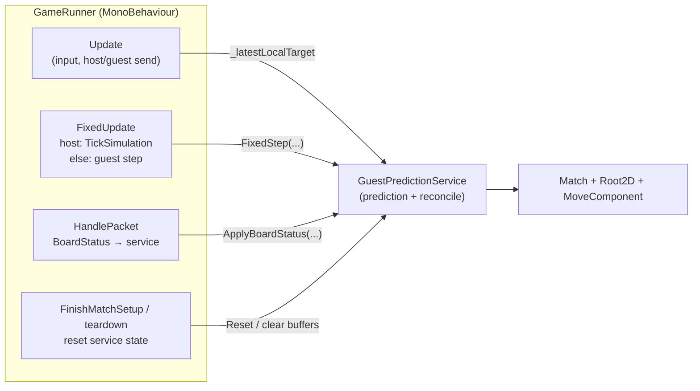
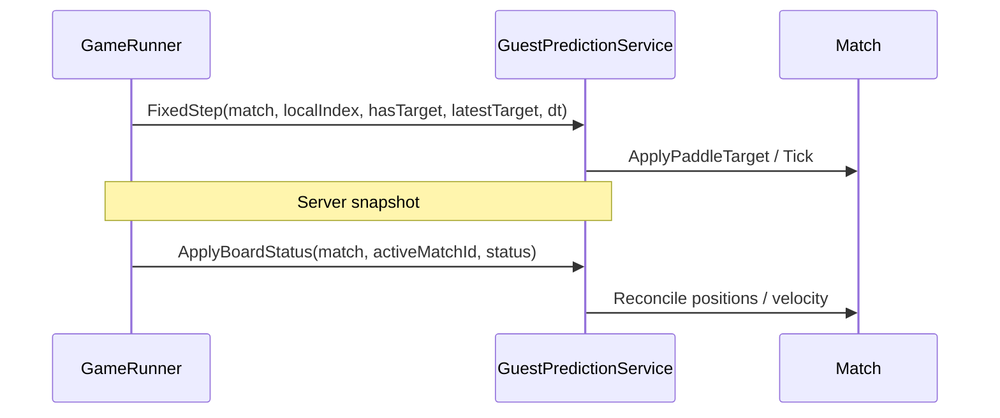

# GameRunner refactor — Guest prediction only

**Scope:** Move **Guest prediction & reconcile** out of `GameRunner.cs` into a dedicated type. Everything else (networking, matchmaking, hosting, UI, input, camera, packet routing, debug drawing) **stays in `GameRunner`** for now.

**Status:** Code extraction done — see checklists below.

---

## 1. What stays vs what moves

### In scope (extract)

| Feature | Today in `GameRunner` | New home |
|---------|----------------------|----------|
| **Guest prediction & reconcile** ✓ | `ClientPredictionFixedStep`, `ApplyBoardStatus`, `ReconcileTowardServerState`, `ReconcilePaddle`, `LerpCv2`, `PaddlePositionFromStatus`; constants `ReconcileSoftLerp`, `PuckSnapDistance`, `PaddleSnapDistance`; state `_lastAuthoritativeBoard`, `_hasAuthoritativeBoard` | `GuestPredictionService` (`Assets/_MH/Scripts/GameLogic/GuestPredictionService.cs`) |

### Out of scope (unchanged in `GameRunner`)

All other behavior remains on `GameRunner`: network `Init` / handlers, matchmaking, LAN host, `HandlePacket` (but `BoardStatus` branch delegates into the service), mouse input / `_latestLocalTarget`, `FixedUpdate` branch that calls host tick vs guest step, camera, teardown, prediction **debug** gizmos / `OnGUI` (still driven by `GameRunner` unless you optionally pass the service snapshot into a tiny helper later).

---

## 2. Target architecture

**Sequence (guest, playing)**

---

## 3. `GuestPredictionService` responsibilities

- **Fixed-step prediction (guest only):** Same rules as today: apply local paddle target when known; drive remote paddle target from last authoritative board when known; call `Match.Tick(dt)`.
- **Apply snapshot:** Validate `status.MatchId` vs `activeMatchId`; run reconcile toward server puck/paddles/velocity; store last board for next fixed step.
- **State:** Own `_lastAuthoritativeBoard` and `_hasAuthoritativeBoard` internally (or equivalent private fields). No Unity APIs inside this class if possible (keeps it testable).
- **Reset:** Method such as `Clear()` or `ResetForNewMatch()` called from `FinishMatchSetup` / `BackToMainMenuInternal` / host path so behavior matches current `_hasAuthoritativeBoard = false` resets.

`GameRunner` still owns: `_isHost`, `_gameState`, `_currentMatch`, `_activeMatchId`, `_localPlayerIndex`, `_latestLocalTarget`, `_hasLatestLocalTarget`. It passes them as arguments (or via a small readonly context struct) into `GuestPredictionService` methods.

---

## 4. `GameRunner` changes (minimal)

- [x] Add a field: e.g. `private readonly GuestPredictionService _guestPrediction = new GuestPredictionService();` (or `new()` in `Init` if you need injection later).
- [x] **`FixedUpdate`:** Replace `ClientPredictionFixedStep()` body with a single call like `_guestPrediction.FixedStep(...)` when not host and playing.
- [x] **`HandlePacket` → `BoardStatus`:** After guards, call `_guestPrediction.ApplyBoardStatus(_currentMatch, _activeMatchId, status)` instead of `ApplyBoardStatus`.
- [x] **Match setup / exit:** Call `_guestPrediction.Reset()` (or `Clear()`) wherever you currently clear `_hasAuthoritativeBoard` / `_lastAuthoritativeBoard`.
- [x] **Debug:** `CaptureSnapshotPredictionErrors` stays on `GameRunner`, passed as `beforeReconcile` so snapshots still compare **pre-reconcile** prediction vs server (gizmo / `OnGUI` unchanged).

---

## 5. Implementation checklist

- [x] Add `GuestPredictionService.cs` with moved private methods and constants; compile.
- [x] Wire `GameRunner` to instantiate/call it; delete duplicated private methods from `GameRunner`.
- [ ] Run through: **guest online** (prediction + snapshots), **host** (no guest path), **match end** (state reset), **new match** (buffers cleared).
- [ ] Optional: unit-test `GuestPredictionService` with a mocked or constructed `Match` if you have a test assembly.

---

## 6. Suggested file location

- `Assets/_MH/Scripts/GameLogic/GuestPredictionService.cs` (or alongside other game-logic types you already use).

Namespace: align with `GameRunner` (e.g. `MH.GameLogic`).

---

*Prior revision listed a full multi-class split of `GameRunner`; this document replaces that with a single extraction per current scope.*
