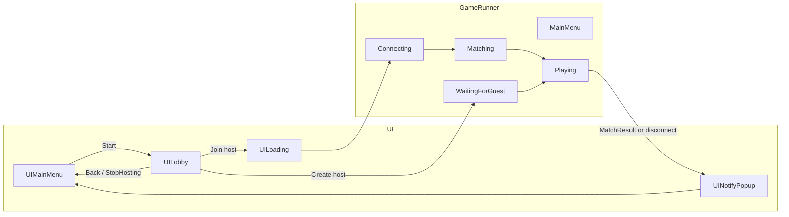

# Game loop: start UI → match → end → start UI

This document describes the **end-to-end client flow** in the Unity project: from the first screen the player sees, through entering a match, ending the match, and returning to the start screen. It is meant to complement [`NETWORK_LAYER.md`](NETWORK_LAYER.md) (wire format and transport) and the host-as-server notes in [`HOST_AS_SERVER_IMPLEMENTATION_PLAN.md`](HOST_AS_SERVER_IMPLEMENTATION_PLAN.md).

**Terminology:** “**Start UI**” here means the main menu window, implemented as `UIMainMenu` (`Assets/_MH/Scripts/UI/Windows/UIMainMenu.cs`). There is no separate `UIStart` type.

---

## State machine (`EGameState`)

`GameRunner` owns `EGameState` (`Assets/_MH/Scripts/EGameState.cs`). Relevant values for this loop:

| State | Meaning |
|--------|--------|
| `MainMenu` | At rest; player can use menus. Set after init and after returning from a match or failed connection. |
| `Connecting` | Client opened a connection to a remote host (dedicated server or LAN host). |
| `Matching` | Connected; client sent find-match / is in server-driven pairing (guest path to `MatchFound`). |
| `WaitingForGuest` | This machine is listening as a LAN host and has not started local play yet. |
| `Playing` | Local `Match` exists; simulation and input apply. |

`None` exists on the enum but `GameRunner.Init` sets `MainMenu` immediately.

---

## Bootstrapping

On play:

1. `Bootstrap.Awake` (`Assets/_MH/Scripts/Boostrap.cs`) constructs `ClientNetwork`, instantiates `GameRunner` and calls `Init(clientNetwork)`, then instantiates `UIManager`.
2. Every frame, `Bootstrap.Update` calls `ClientNetwork.PollEvents()` so LiteNetLib delivers connects, disconnects, and packets.
3. `GameRunner` registers for `MatchFound`, `BoardStatus`, `MatchResult`, and subscribes to `OnConnected` / `OnDisconnected`.

The start UI is shown according to your `UIManager` prefab stack; typically the player begins on `UIMainMenu`.

---

## Phase 1 — Start UI → lobby

From `UIMainMenu`, **Start** hides the main menu and shows `UILobby`:

- `UIMainMenu.OnStartClicked` → `UIManager.Hide<UIMainMenu>()`, `Show<UILobby>()`.

The lobby is where the player chooses **LAN host** vs **join a discovered host** (`UILobby`, `Assets/_MH/Scripts/UI/Windows/UILobby.cs`).

**Back from lobby:** `UILobby.OnBackClicked` calls `GameRunner.StopHosting()` if needed, hides the lobby, shows `UIMainMenu` again (`EGameState` returns to `MainMenu` when hosting stops while in `WaitingForGuest`).

---

## Phase 2 — Entering a match (two paths)

### Path A — Join a host (guest)

1. Player uses **Find Host** / list and selects a host, or equivalent list binding (`OnHostSelected`).
2. UI hides `UILobby`, shows `UILoading` if registered.
3. `GameRunner.ConnectAndRequestMatchmaking(host, port)` runs:
   - Guards against double connect while `Connecting` / `Matching` / `WaitingForGuest` / `_isHost`.
   - Optionally `ClientNetwork.SetConnectionTarget(host, port)`.
   - Sets `EGameState.Connecting`, hides main menu and lobby, shows loading.
   - `ClientNetwork.StartConnect()`.

4. On connect: `OnServerConnected` sets `Matching` and sends `c2s_find_match`.
5. On `s2c_match_found`: `GameRunner.HandlePacket` → `BeginLocalMatch` → `FinishMatchSetup`:
   - Builds or attaches `MatchView2D`, sets `_currentMatch`, `_localPlayerIndex`, camera flip for top player.
   - `EGameState.Playing`; hides loading and lobby.

Until play starts, **disconnect** triggers `OnServerDisconnected` → notify popup (or fallback) → `BackToMainMenuInternal` (see Phase 4).

### Path B — Create host (listen server in Unity)

1. **Create Host** → `GameRunner.StartHosting()` (`HostGameSession`):
   - Fails if already connecting, matching, waiting, or playing.
   - Binds UDP (shared `NetworkConstants.DefaultGamePort`), starts `MatchmakingHandler` / `MatchSessionManager` stack.
   - Sets `WaitingForGuest`; UI stays on `UILobby` with “waiting” visuals.

2. When a guest is paired, host-side logic creates the authoritative `Match` and calls `BeginLocalMatchAsHost` → same `FinishMatchSetup` as guests (host is bottom player, index `0`).

3. **Cancel hosting:** Back on lobby or `StopHosting` tears down the session; if state was `WaitingForGuest`, `EGameState` becomes `MainMenu`.

---

## Phase 3 — During play

- **Host:** `FixedUpdate` drives `HostGameSession.TickSimulation`; host paddle targets via `ApplyHostInput`. Guest paddle targets arrive as `c2s_mouse_pos` on the host network stack.
- **Guest:** `Update` sends mouse targets via `ClientNetwork.Send(c2s_mouse_pos)` when not host; `BoardStatus` packets update puck and paddles from authority.
- **Condition:** `GameRunner.Update` only runs match input when `EGameState.Playing` and `_currentMatch != null`.

---

## Phase 4 — Match end → back to start UI

### Normal / server-driven end (`MatchResult`)

`GameRunner` handles `EServerCmd.MatchResult` in `HandleMatchResult`:

- If not `Playing`, ignored.
- Builds win/lose copy from `WinnerPlayerIndex` vs `_localPlayerIndex`.
- `ShowNotifyAndBackToMainMenu` → `UINotifyPopup` with **OK** → `BackToMainMenuInternal`.

### Disconnect

`OnServerDisconnected`:

- If `Playing`: notify “Lost connection to server.”
- Otherwise: notify “Could not connect to server.” (matchmaking failure).

Same popup path ends in `BackToMainMenuInternal` when the user confirms (or immediately if no popup is registered).

### `BackToMainMenuInternal` (cleanup)

1. `StopHosting()` — dispose LAN host session if any.
2. Clear `MatchView2D` match reference, null `_currentMatch`, `EGameState.MainMenu`.
3. Restore main camera rotation if it was flipped for the top player.
4. UI: hide loading and notify; show `UIMainMenu`.

This closes the loop back to the **start UI**.

---

## Sequence overview

---

## Key implementation files

| Area | Path |
|------|------|
| Boot + poll | `Assets/_MH/Scripts/Boostrap.cs` |
| State + match lifecycle | `Assets/_MH/Scripts/GameRunner.cs` |
| States enum | `Assets/_MH/Scripts/EGameState.cs` |
| Main menu | `Assets/_MH/Scripts/UI/Windows/UIMainMenu.cs` |
| Lobby / discovery / join | `Assets/_MH/Scripts/UI/Windows/UILobby.cs` |
| Client transport + dispatcher | `Assets/_MH/Scripts/Network/ClientNetwork.cs` |
| LAN host session | `Assets/_MH/Scripts/Network/HostGameSession.cs` |

---

## Notes

- **`RequestMatchmaking()`** (connect to whatever `ClientNetwork` already targets, default `localhost:9050`) exists on `GameRunner` but the **current UI** enters matchmaking from the lobby via **`ConnectAndRequestMatchmaking`** after picking a discovered host. Any “quick play to default server” button would call `RequestMatchmaking` explicitly.
- **Threading:** LiteNetLib callbacks are processed inside `PollEvents`; handlers should not touch Unity objects off the main thread unless your code marshals back (current handlers are written for main-thread UI use after poll).
