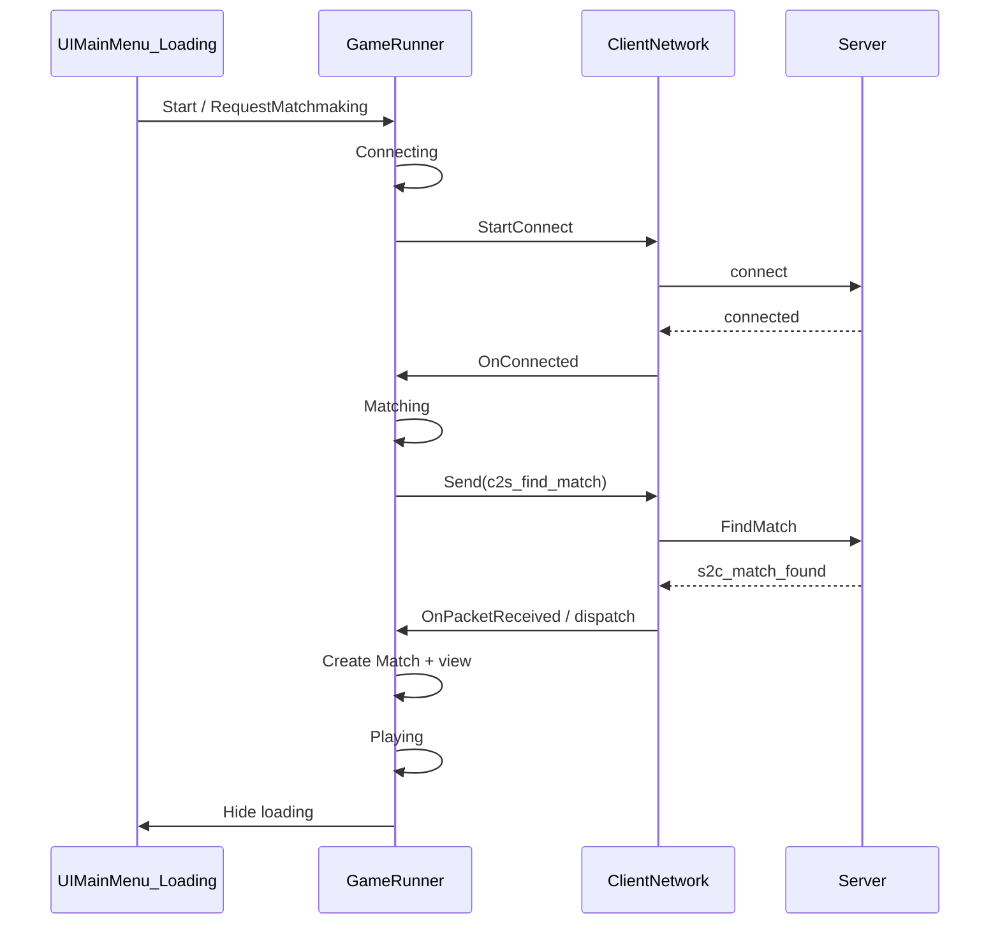

# Matching logic — implementation plan

This plan wires **menu → connect → find match → match found → local match** so client `EGameState` reflects the flow and **server commands** drive match creation. It aligns with the network wire format described in [`NETWORK_LAYER.md`](NETWORK_LAYER.md) (leading `int` command id, `INetPacket` serialize/deserialize).

**Target user flow**

1. Enter Play Mode → show `UIMainMenu`.
2. Player clicks **Start** → show **Loading** UI.
3. Connection succeeds → send **Find Match** to the server.
4. Server sends **Match Found** → client creates the local `Match` (and view) and enters play.

**Key code touchpoints**

- `Assets/_MH/Scripts/UI/Windows/UIMainMenu.cs` — Start button intent (`_startMatchmakingOnClick`, default on).
- `Assets/_MH/Scripts/UI/Windows/UILoading.cs` — loading window (registered on `UIManger` prefab with `UIMainMenu`).
- `Assets/_MH/Scripts/GameRunner.cs` — `_gameState`, match creation, `IPacketHandler` for `MatchFound`.
- `Assets/_MH/Scripts/ClientNetwork.cs` — `INetworkManager` + `PacketDispatcher`, connect/disconnect events.
- `Assets/_MH/Scripts/EGameState.cs` — `MainMenu`, `Connecting`, `Matching`, `Playing`.
- `Assets/_MH/Scripts/Boostrap.cs` — `PollEvents` + `Dispose` client.
- `Assets/_MH/SharedLibrary/GameLogic/ClientCmd.cs` — `c2s_find_match`, `EClientCmd.FindMatch`.
- `Assets/_MH/SharedLibrary/GameLogic/ServerCmd.cs` — `s2c_match_found`, `EServerCmd.MatchFound`.
- `Server/GameLogic/MatchmakingHandler.cs` — pairs two queued clients and sends `MatchFound`.

**Shared protocol** (keep server and Unity in sync)

- Add/extend commands in `SharedLibrary` (this tree and `Server Sln/Shared/…` if duplicated).

---

## Phase 0 — Preconditions

| Item | Action | Status |
|------|--------|--------|
| Receive path | `ClientNetwork.OnNetworkReceive` dispatches binary payloads via `PacketDispatcher`. | Done |
| Poll | `Bootstrap.Update` calls `ClientNetwork.PollEvents()`. | Done |
| Packet source | Shared `ClientCmd` / `ServerCmd` live under `SharedLibrary` (hardlinked with server `Shared`). | Done |

---

## Phase 1 — Client network receive API (`ClientNetwork`)

**Goal:** One path from LiteNetLib to typed server→client commands.

| Step | Task | Status |
|------|------|--------|
| 1.1 | `ClientNetwork` implements `INetworkManager`; constructs `PacketDispatcher(this)`; exposes `Dispatcher`. | Done |
| 1.2 | On receive: invoke registered callbacks; `PacketDispatcher` reads leading `cmdType` then `Deserialize` on payload. `reader.Recycle()` in `finally`. | Done |
| 1.3 | `Send<TPacket>` unchanged; **c2s** packets write cmd id first (`c2s_find_match`, `c2s_mouse_pos`). | Done |

---

## Phase 2 — Protocol: Find Match & Match Found

**Goal:** Explicit contract before UI and `GameRunner` hard-code behavior.

| Direction | Suggested pieces | Status |
|-----------|------------------|--------|
| **c2s** | `EClientCmd.FindMatch`, struct `c2s_find_match` (empty body). | Done |
| **s2c** | `EServerCmd.MatchFound`, struct `s2c_match_found` (`MatchId`, `LocalPlayerIndex` 0 or 1). | Done |

**Server:** `MatchmakingHandler` queues first client; second `FindMatch` pairs and sends `MatchFound` with indices 0 and 1. **Note:** Server no longer sends the legacy string `"Hello client!"` (would break `PacketDispatcher` on the client).

---

## Phase 3 — `GameRunner` orchestration

**Goal:** Own `_gameState` transitions and match creation; react to packets.

| Step | Task | Status |
|------|------|--------|
| 3.1 | `Init` registers `s2c_match_found` on dispatcher; subscribes `OnConnected` / `OnDisconnected`; `OnDestroy` unregisters. | Done |
| 3.2 | `MainMenu` → `Connecting` (`RequestMatchmaking`) → connected → `Matching` + send `c2s_find_match` → `MatchFound` → `Playing`. | Done |
| 3.3 | `BeginLocalMatch` builds `Match(0,1)`, `MatchView2D`, sets `_localPlayerIndex`; editor `TestMatch` calls it. | Done |
| 3.4 | `Update` runs sim only when `_gameState == Playing` and `_currentMatch != null`; paddle input uses `_localPlayerIndex`. | Done |

---

## Phase 4 — UI: Main menu → Loading

**Goal:** UI sends intent; `GameRunner` performs connect + matchmaking.

| Step | Task | Status |
|------|------|--------|
| 4.1 | `UIMainMenu`: when `_startMatchmakingOnClick`, `OnStartClicked` calls `GameRunner.RequestMatchmaking()`. | Done |
| 4.2 | **Single owner:** `RequestMatchmaking` sets `Connecting`, hides main menu, shows `UILoading` (if registered), `StartConnect`; `OnServerConnected` sends `FindMatch`. | Done |
| 4.3 | Loading dismissed on `MatchFound` or disconnect; disconnect during matchmaking returns to main menu (`Show<UIMainMenu>()` when registered). | Done |

**Prefab setup:** `Assets/_MH/Prefab/UI/UIManger.prefab` lists `UIMainMenu` and `UILoading`. `UILoading` prefab: `Assets/_MH/Prefab/UI/Window/UILoading.prefab`.

---

## Phase 5 — Bootstrap lifecycle

| Step | Task | Status |
|------|------|--------|
| 5.1 | `Update` → `_clientNetwork.PollEvents()`. | Done |
| 5.2 | `OnDestroy` / `OnApplicationQuit` → `_clientNetwork.Dispose()` (idempotent). | Done |

---

## Phase 6 — Edge cases

| Item | Status |
|------|--------|
| Double Start while `Connecting` / `Matching` | Ignored in `RequestMatchmaking`. |
| `MatchFound` while already `Playing` | Logged and ignored. |
| Disconnect during matchmaking | `OnDisconnected` → `MainMenu`, hide loading, show menu (not mid-`Playing`). |
| Threading | LiteNetLib callbacks on poll thread; Unity object use stays on main thread for current handlers. |

---

## Sequence (reference)

---

## Suggested implementation order

1. ~~Poll + binary receive dispatch in `ClientNetwork`~~
2. ~~Protocol + minimal server pairing~~
3. ~~`GameRunner` state machine + match spawn~~
4. ~~UI + prefabs~~
5. Timeouts and richer error UI (optional follow-up).
