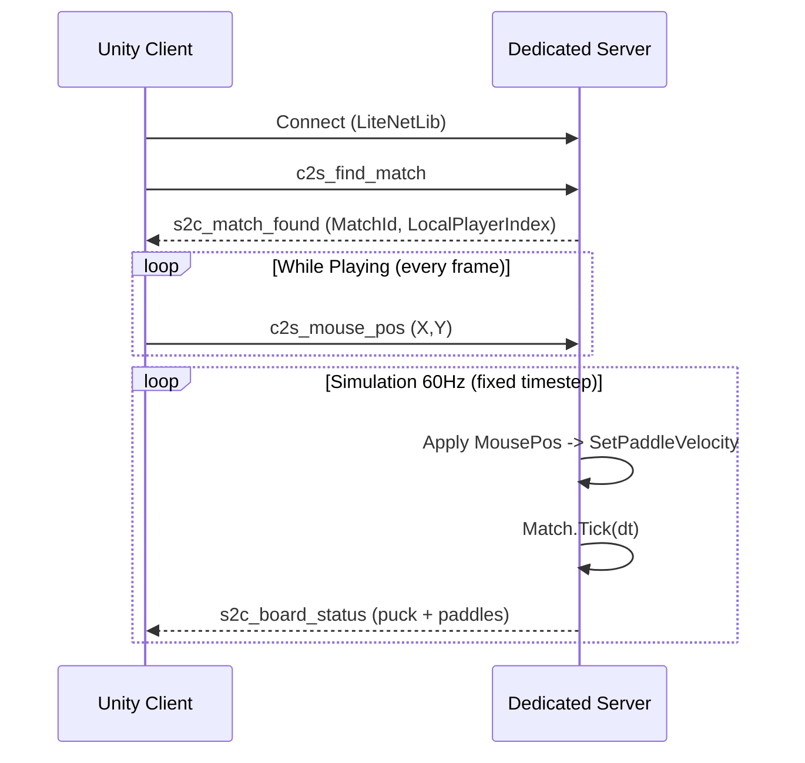

# Match sync architecture (authoritative server)

This document describes how an online match is synchronized between **Unity client** and **dedicated server**.

## Goals

- **Server authoritative**: only the server runs the real simulation.
- **Client lightweight**: client sends input (mouse target) and applies server snapshots (`BoardStatus`).
- **Shared protocol**: packets are `INetPacket` with a leading `int` command id (handled by `PacketDispatcher`).

## High-level responsibilities

- **Client (Unity)**
  - Creates a local `Match` for **rendering** and, on **guest** clients, for **prediction** (`Match.Tick` at 60 Hz between snapshots; see [CLIENT_PREDICTION_IMPLEMENTATION_PLAN.md](CLIENT_PREDICTION_IMPLEMENTATION_PLAN.md)).
  - Sends `c2s_mouse_pos` as player input (target point in world space).
  - On each `s2c_board_status`, **reconciles** toward server puck/paddle state (host uses authoritative sim only).

- **Server (.NET headless)**
  - Creates a server-side `Match` when matchmaking pairs 2 peers.
  - Applies `c2s_mouse_pos` to set paddle velocity.
  - Runs a fixed simulation loop (60 Hz).
  - Broadcasts `s2c_board_status` to both peers every tick.

## Data model

Both client and server use the same deterministic entity model:

- `Match` owns:
  - `Puck`
  - 2 `HockeyPlayer` entries (playerId `0` bottom, playerId `1` top)
  - walls/colliders

The `Match.Tick(dt)` updates paddles then puck, with collision response.

## Packet definitions

### Client → Server

- `EClientCmd.FindMatch` / `c2s_find_match`
- `EClientCmd.MousePos` / `c2s_mouse_pos`
  - `float X`, `float Y` (mouse target in world-space coordinates)

### Server → Client

- `EServerCmd.MatchFound` / `s2c_match_found`
  - `int MatchId`
  - `int LocalPlayerIndex` (0 or 1)

- `EServerCmd.BoardStatus` / `s2c_board_status`
  - `int MatchId`
  - puck: `PuckX`, `PuckY`, `PuckVelX`, `PuckVelY`
  - paddles: `Paddle0X`, `Paddle0Y`, `Paddle1X`, `Paddle1Y`

## Lifecycle / flow

## Server-side match creation

- `MatchmakingHandler` pairs two waiting peers.
- It emits `OnMatchCreated(matchId, peerBottom, peerTop)`.
- `MatchSessionManager.CreateMatch(...)` creates:
  - `new Match(0, 1, config)`
  - maps `peerBottom -> playerId 0`, `peerTop -> playerId 1`

## Input → movement conversion

The server converts target position to velocity:

- `vel = (target - paddlePos) * BoardConfig.PaddlePositionFollow`
- clamped by `BoardConfig.PaddleMaxSpeed` inside `Match.SetPaddleVelocity(...)`

This keeps client input simple and pushes all movement constraints to the server.

## Client-side application of snapshots

**Dedicated client (guest)** — see [CLIENT_PREDICTION_IMPLEMENTATION_PLAN.md](CLIENT_PREDICTION_IMPLEMENTATION_PLAN.md):

- Runs a local `Match` at **60 Hz** (`Time.fixedDeltaTime`) between packets: same `Match.Tick` / `ApplyPaddleTargetFromWorld` path as the server for **prediction**.
- On each `s2c_board_status`, **reconciles** predicted state toward the server (soft blend under a distance threshold, else snap). Host / listen-server uses the authoritative `Match` only (no snapshot apply loopback).

**Rough data flow on guest**

- Puck: predicted position/velocity between snapshots; blended toward `PuckX/Y`, `PuckVelX/Y` on receive.
- Paddles: local player from live input; remote player driven toward last snapshot paddle position each predicted tick (no opponent input relay); positions corrected on receive.

The local `Match` drives `MatchView2D` and guest prediction.

## Notes / follow-ups

- **Client prediction** for guests is implemented in Unity `GameRunner` (debug gizmo/HUD: `Show Prediction Debug`). Further work (rewind–replay, tick in protocol) is listed in [CLIENT_PREDICTION_IMPLEMENTATION_PLAN.md](CLIENT_PREDICTION_IMPLEMENTATION_PLAN.md).
- Add scoring / goals by extending `s2c_board_status` (or adding separate events) once goal detection is implemented server-side.

