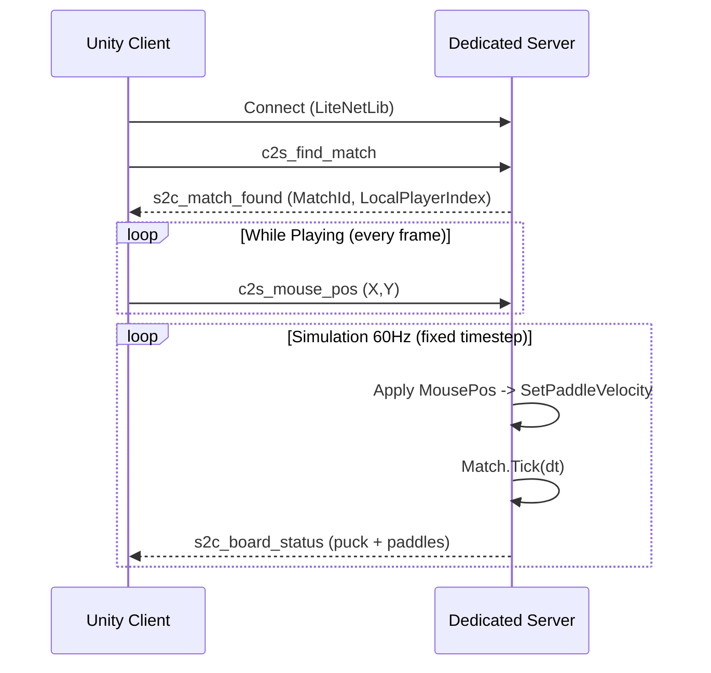

# Match sync architecture (authoritative server)

This document describes how an online match is synchronized between **Unity client** and **dedicated server**.

## Goals

- **Server authoritative**: only the server runs the real simulation.
- **Client lightweight**: client sends input (mouse target) and applies server snapshots (`BoardStatus`).
- **Shared protocol**: packets are `INetPacket` with a leading `int` command id (handled by `PacketDispatcher`).

## High-level responsibilities

- **Client (Unity)**
  - Creates a local `Match` only for **rendering** (views bind to entities).
  - Sends `c2s_mouse_pos` as player input (target point in world space).
  - Applies `s2c_board_status` snapshots to puck/paddle transforms (no local physics tick).

- **Server (.NET headless)**
  - Creates a server-side `Match` when matchmaking pairs 2 peers.
  - Applies `c2s_mouse_pos` to set paddle velocity.
  - Runs a fixed simulation loop (60 Hz).
  - Broadcasts `s2c_board_status` to both peers every tick.

## Data model

Both client and server use the same deterministic entity model:

- `Match` owns:
  - `Puck`
  - 2 `HockeyPlayer` entries (playerId `0` bottom, playerId `1` top)
  - walls/colliders

The `Match.Tick(dt)` updates paddles then puck, with collision response.

## Packet definitions

### Client → Server

- `EClientCmd.FindMatch` / `c2s_find_match`
- `EClientCmd.MousePos` / `c2s_mouse_pos`
  - `float X`, `float Y` (mouse target in world-space coordinates)

### Server → Client

- `EServerCmd.MatchFound` / `s2c_match_found`
  - `int MatchId`
  - `int LocalPlayerIndex` (0 or 1)

- `EServerCmd.BoardStatus` / `s2c_board_status`
  - `int MatchId`
  - puck: `PuckX`, `PuckY`, `PuckVelX`, `PuckVelY`
  - paddles: `Paddle0X`, `Paddle0Y`, `Paddle1X`, `Paddle1Y`

## Lifecycle / flow

## Server-side match creation

- `MatchmakingHandler` pairs two waiting peers.
- It emits `OnMatchCreated(matchId, peerBottom, peerTop)`.
- `MatchSessionManager.CreateMatch(...)` creates:
  - `new Match(0, 1, config)`
  - maps `peerBottom -> playerId 0`, `peerTop -> playerId 1`

## Input → movement conversion

The server converts target position to velocity:

- `vel = (target - paddlePos) * BoardConfig.PaddlePositionFollow`
- clamped by `BoardConfig.PaddleMaxSpeed` inside `Match.SetPaddleVelocity(...)`

This keeps client input simple and pushes all movement constraints to the server.

## Client-side application of snapshots

When receiving `s2c_board_status`, the client applies:

- Puck:
  - `Root2D.Position = (PuckX, PuckY)`
  - `MoveComponent.SetVelocity = (PuckVelX, PuckVelY)`
- Paddles:
  - player0 paddle `Root2D.Position = (Paddle0X, Paddle0Y)`
  - player1 paddle `Root2D.Position = (Paddle1X, Paddle1Y)`

The local `Match` exists primarily so `MatchView2D` can bind and render entities.

## Notes / follow-ups

- This is a **snapshot sync** (no client prediction yet). If you need smoother motion, add interpolation buffers on the client or add client-side prediction + reconciliation.
- Add scoring / goals by extending `s2c_board_status` (or adding separate events) once goal detection is implemented server-side.

