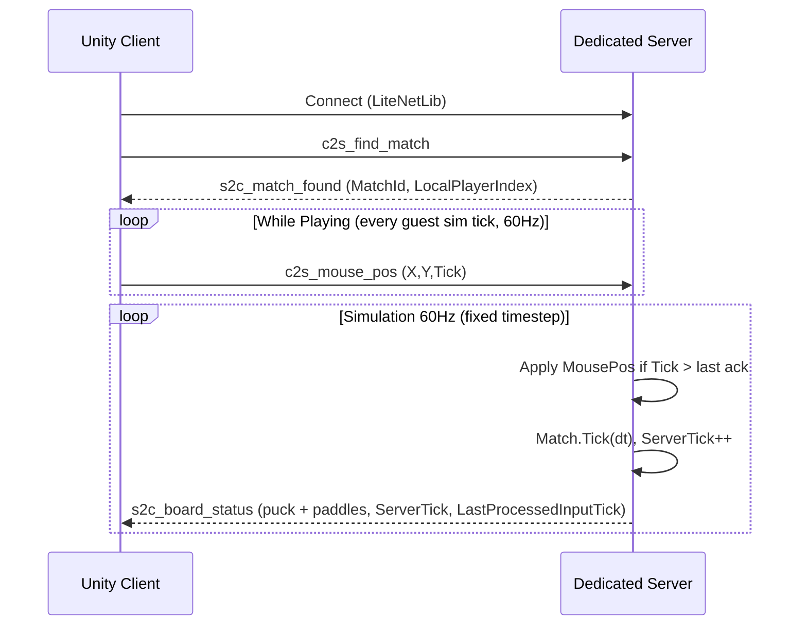

# Match sync architecture (authoritative server)

This document describes how an online match is synchronized between **Unity client** and **dedicated server**.

## Goals

- **Server authoritative**: only the server runs the real simulation.
- **Client lightweight**: client sends input (mouse target) and applies server snapshots (`BoardStatus`).
- **Shared protocol**: packets are `INetPacket` with a leading `int` command id (handled by `PacketDispatcher`).

## High-level responsibilities

- **Client (Unity)**
  - Creates a local `Match` for **rendering** and, on **guest** clients, for **prediction** (`Match.Tick` at 60 Hz between snapshots; see [CLIENT_PREDICTION_IMPLEMENTATION_PLAN.md](CLIENT_PREDICTION_IMPLEMENTATION_PLAN.md) and [PLAYER_PREDICTION_TICK_RECONCILE_PLAN.md](PLAYER_PREDICTION_TICK_RECONCILE_PLAN.md)).
  - Sends `c2s_mouse_pos` once per guest sim tick (mouse target + `Tick`).
  - On each `s2c_board_status`, **snaps** to server state at `LastProcessedInputTick` and **replays** unacked local inputs (host uses authoritative sim only).

- **Server (.NET headless)**
  - Creates a server-side `Match` when matchmaking pairs 2 peers.
  - Applies `c2s_mouse_pos` to set paddle velocity.
  - Runs a fixed simulation loop (60 Hz).
  - Broadcasts `s2c_board_status` to both peers every tick.

## Data model

Both client and server use the same deterministic entity model:

- `Match` owns:
  - `Puck`
  - 2 `HockeyPlayer` entries (playerId `0` bottom, playerId `1` top)
  - walls/colliders

The `Match.Tick(dt)` updates paddles then puck, with collision response.

## Packet definitions

### Client → Server

- `EClientCmd.FindMatch` / `c2s_find_match`
- `EClientCmd.MousePos` / `c2s_mouse_pos`
  - `float X`, `float Y` (mouse target in world-space coordinates)
  - `uint Tick` — guest input / prediction step (starts at 1; `0` is reserved)

### Server → Client

- `EServerCmd.MatchFound` / `s2c_match_found`
  - `int MatchId`
  - `int LocalPlayerIndex` (0 or 1)

- `EServerCmd.BoardStatus` / `s2c_board_status`
  - `int MatchId`
  - puck: `PuckX`, `PuckY`, `PuckVelX`, `PuckVelY`
  - paddles: `Paddle0X`, `Paddle0Y`, `Paddle1X`, `Paddle1Y`
  - `int Score0`, `int Score1`
  - `byte MatchPhase` — `0` = `MatchPhase.Playing`, `1` = `MatchPhase.PostGoal` (input frozen on authoritative side; guest should not run prediction ticks until `Playing` again).
  - `uint ServerTick` — monotonic authoritative sim step (first tick is 1). Guests drop snapshots with `ServerTick` ≤ last applied.
  - `uint LastProcessedInputTick` — **this recipient’s** last applied `c2s_mouse_pos.Tick` (`0` = none yet). Do not share one ack value across both peers.

- `EServerCmd.GoalScored` / `s2c_goal_scored`
  - `int MatchId`, `ScoringPlayerIndex`, `ConcedingPlayerIndex`, `Score0`, `Score1`, `ResetDurationMs`
  - Emitted once when the puck enters a goal; listen-server invokes `MatchSessionManager.OnLocalHostGoalScored` for the local host peer instead of loopback send.

## Lifecycle / flow

```mermaid
sequenceDiagram
    participant C as Unity Client
    participant S as Dedicated Server

    C->>S: Connect (LiteNetLib)
    C->>S: c2s_find_match
    S-->>C: s2c_match_found (MatchId, LocalPlayerIndex)

    loop While Playing (every guest sim tick, 60Hz)
        C->>S: c2s_mouse_pos (X,Y,Tick)
    end

    loop Simulation 60Hz (fixed timestep)
        S->>S: Apply MousePos if Tick > last ack
        S->>S: Match.Tick(dt), ServerTick++
        S-->>C: s2c_board_status (puck + paddles, ServerTick, LastProcessedInputTick)
    end
```

## Server-side match creation

- `MatchmakingHandler` pairs two waiting peers.
- It emits `OnMatchCreated(matchId, peerBottom, peerTop)`.
- `MatchSessionManager.CreateMatch(...)` creates:
  - `new Match(0, 1, config)`
  - maps `peerBottom -> playerId 0`, `peerTop -> playerId 1`

## Input → movement conversion

The server converts target position to velocity:

- `vel = (target - paddlePos) * BoardConfig.PaddlePositionFollow`
- clamped by `BoardConfig.PaddleMaxSpeed` inside `Match.SetPaddleVelocity(...)`

This keeps client input simple and pushes all movement constraints to the server.

## Client-side application of snapshots

**Dedicated client (guest)** — see [CLIENT_PREDICTION_IMPLEMENTATION_PLAN.md](CLIENT_PREDICTION_IMPLEMENTATION_PLAN.md) and [PLAYER_PREDICTION_TICK_RECONCILE_PLAN.md](PLAYER_PREDICTION_TICK_RECONCILE_PLAN.md):

- Runs a local `Match` at **60 Hz** (`Time.fixedDeltaTime`) between packets: same `Match.Tick` / `ApplyPaddleTargetFromWorld` path as the server for **prediction**. Each predicted tick stamps `c2s_mouse_pos.Tick` and stores `{ Tick, mouse }` in a short history ring.
- On each `s2c_board_status`, drop stale `ServerTick`, **snap** puck/paddles to the snapshot (truth as of `LastProcessedInputTick`), then **replay** history with `Tick > LastProcessedInputTick`. The local paddle is **not** lerped toward the snapshot. Host / listen-server uses the authoritative `Match` only (no snapshot apply loopback).

**Rough data flow on guest**

- Puck: predicted between snapshots; on receive, snapped to `PuckX/Y` + velocity then re-simulated during input replay.
- Local paddle: predicted from live mouse; corrected by snap-at-ack + replay of unacked samples.
- Remote paddle: driven toward last snapshot paddle position each predicted tick (no opponent input relay).

The local `Match` drives `MatchView2D` and guest prediction.

## Notes / follow-ups

- **Client prediction** for guests is implemented in Unity `GameRunner` / `GuestPredictionService` (debug gizmo/HUD: `Show Prediction Debug`). Tick protocol and rewind-replay: [PLAYER_PREDICTION_TICK_RECONCILE_PLAN.md](PLAYER_PREDICTION_TICK_RECONCILE_PLAN.md).
- **Goals / scoring**: authoritative `Match` detects puck vs `GoalFrame`, enters `PostGoal` for `BoardConfig.PostGoalResetDelaySeconds`, then respawns the puck beside the conceding player. Guests use `new Match(..., registerGoalTriggers: false)` so only the server awards goals; `GuestPredictionService` skips `Match.Tick` while `MatchPhase == PostGoal` and snaps state on `s2c_board_status`.

