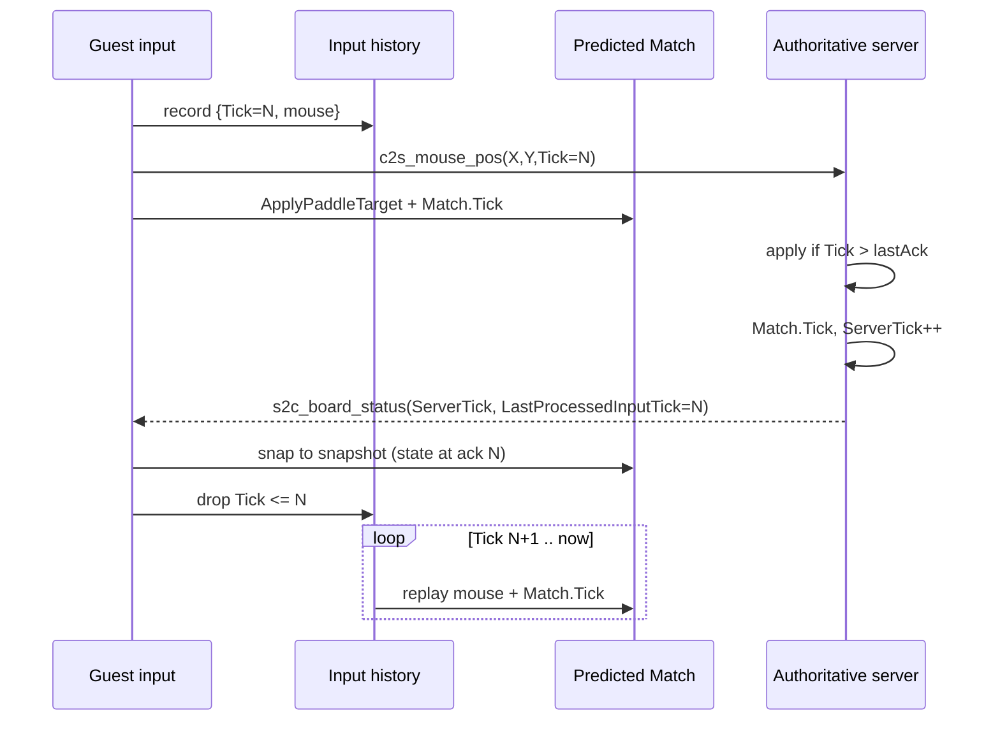

# Implementation plan: Tick-based player prediction

Replace **lerp-toward-snapshot** for the local paddle with **tick-keyed rewind-and-replay**. The server snapshot is a **past** pose (already missing inputs the client has predicted). Lerping the live predicted paddle toward that pose pulls the local player backward and fights their input.

**Done** means: guest and server compare state on the **same input tick**; unacknowledged mouse samples are replayed; the local paddle is not blended toward a stale snapshot.

This is Phase 3 of [CLIENT_PREDICTION_IMPLEMENTATION_PLAN.md](CLIENT_PREDICTION_IMPLEMENTATION_PLAN.md). Authority does not change: the server still owns scoring and board truth.

## Context (current codebase)

- **Guest prediction** (`Air Hockey Online_Unity/Assets/_MH/Scripts/GameLogic/GuestPredictionService.cs`): each `FixedUpdate` runs `Match.Tick` at 60 Hz. Local paddle uses the latest mouse target; remote paddle is steered toward the last `s2c_board_status` paddle position. On every snapshot, `ReconcileTowardServerState` **lerps** puck + both paddles toward server positions (full snap if error ≥ threshold). That lerp is the bug for the **local** paddle.
- **Input send** (`GameRunner.Update`): guest sends `c2s_mouse_pos { X, Y }` every render frame with **no tick**. Tick identity does not exist on the wire.
- **Protocol** (hardlinked Unity `SharedLibrary` ↔ `Server Sln/Shared`):
  - `c2s_mouse_pos` — `float X`, `float Y` only (`ClientCmd.cs`).
  - `s2c_board_status` — match id, puck pose/vel, both paddle positions, scores, `MatchPhase`. **No** `ServerTick`, **no** `LastProcessedInputTick` (`ServerCmd.cs`).
- **Server apply** (`MatchSessionManager.HandlePacket`): on each mouse packet, immediately `ApplyPaddleTargetFromWorld`. `TickAndBroadcast` then `Match.Tick` and sends the **same** status struct to both peers. Per-player input ack is not stored.
- **Host / listen-server**: `HostGameSession` ticks the same `MatchSessionManager`; host input is `ApplyHostBottomPaddleTarget` (no packet, no tick). Host does **not** run `GuestPredictionService`. This plan applies to **guest** clients; host gameplay truth stays local.
- **Delivery**: `c2s_mouse_pos` is `ReliableOrdered`. Stale mouse packets can still arrive; a tick field is how the server drops them.
- **Post-goal**: existing hard snap + skip prediction while `MatchPhase == PostGoal` stays.

## Product flow (requirement)

1. Guest samples mouse, assigns a monotonic **client input tick**, stores `{ Tick, X, Y }` in a local history ring, and sends `c2s_mouse_pos` with that `Tick`.
2. Guest immediately predicts with the same `Match.Tick` path as today (responsive paddle).
3. Server applies the mouse sample (ignore `Tick` ≤ last applied for that player), runs the sim tick, and increments **`ServerTick`**.
4. Server sends `s2c_board_status` with **`ServerTick`** and **`LastProcessedInputTick`** = that **recipient’s** last applied `c2s_mouse_pos.Tick`.
5. Guest **drops** snapshots with `ServerTick` ≤ last applied server tick (stale / out of order).
6. Guest treats snapshot paddle/puck as truth **as of `LastProcessedInputTick`**, not as truth for “now”. It snaps predicted state to the snapshot, **discards history with `Tick <= LastProcessedInputTick`**, then **replays** remaining inputs through `ApplyPaddleTargetFromWorld` + `Match.Tick`.
7. Render uses the replayed predicted match. Local paddle is never lerped toward the snapshot.

## Design notes

### Why lerp is wrong

`s2c_board_status` is **RTT/2 old**. The guest has already applied inputs the server has not processed. Distance(`predictedNow`, `serverSnapshot`) is mostly **unacked prediction**, not error. Lerping that gap rubber-bands the local paddle. Correct compare: snapshot vs **predicted state at `LastProcessedInputTick`**, then replay.

### Two clocks (do not merge them)

| Field | Owner | Meaning |
|--------|--------|---------|
| **Client `Tick`** on `c2s_mouse_pos` | Guest | Monotonic input / prediction step. Increments once per guest `FixedUpdate` while playing. |
| **`ServerTick`** on `s2c_board_status` | Server | Monotonic authoritative sim step. Used to **order/drop snapshots**. |
| **`LastProcessedInputTick`** | Server, **per recipient** | That peer’s last `c2s_mouse_pos.Tick` that was applied **before** this snapshot’s `Match.Tick`. Used to **trim and replay** history. |

Do **not** require `clientTick == ServerTick`. They start at different times and run on different machines.

### `LastProcessedInputTick` is per recipient

One field on the packet, as specified. `TickAndBroadcast` already calls `SendBoardStatus` twice — set the field **per peer** before each send:

- Bottom peer → last processed tick for player 0
- Top peer → last processed tick for player 1

Host local peer is not sent board status (unchanged). Guest always sees **their** ack tick.

If no input from that player yet, send `0`. Guest must not replay from a bogus ack: treat `0` as “no ack yet” and **hard-snap** (or skip rewind) until the first non-zero ack.

### Wire format (breaking)

No packet version field exists today. Adding `uint` fields **requires client and dedicated server to ship together**.

`c2s_mouse_pos` serialize order after cmd id: `X`, `Y`, **`Tick`**.

`s2c_board_status` serialize order: existing fields (ending `MatchPhase`), then **`ServerTick`**, then **`LastProcessedInputTick`**. Append-only keeps a slightly clearer mismatch if an old build connects (garbage ticks vs shifted floats).

### When to stamp and send input

Move **send** off `GameRunner.Update` onto the **same** 60 Hz step as prediction (`GuestPredictionFixedStep` / `FixedUpdate`):

1. Sample mouse in `Update` into `_latestLocalTarget` (as today).
2. In the guest fixed step: `clientTick++`, push history, send `{ X, Y, Tick }`, then `FixedStep`.

One packet per sim tick keeps `Tick` 1:1 with predicted `Match.Tick`. Sending from `Update` would reuse or skip ticks when render rate ≠ 60 Hz.

Cap history (e.g. 2 s × 60 = 120 samples). If a snapshot’s ack is older than the buffer, **hard-snap** and clear history (lossy / huge hitch).

### Reconcile policy (Playing)

**Replace** `ReconcileTowardServerState` lerp/snap-threshold for Playing:

1. Ignore if `ServerTick <= lastAppliedServerTick`.
2. Snap **puck position + velocity** and **both paddle positions** from the snapshot (authoritative pose at this server tick).
3. Replay local inputs with `Tick > LastProcessedInputTick` in order: same as `FixedStep` (local target from history, remote target from **this** snapshot’s remote paddle).
4. Do **not** lerp the local paddle after replay.

Remote paddle between snapshots stays “steer toward last snapshot position” (no opponent input relay). Puck is corrected by snap + replay, not by lerp.

**PostGoal**: keep today’s hard snap; do not increment useful replay; do not send mouse (existing freeze).

### Server apply vs tick

Keep apply-on-receive (current), with tick guards:

- If `mouse.Tick <= lastProcessed[playerId]`, drop.
- Else `ApplyPaddleTargetFromWorld` and store `pendingAckTick[playerId] = mouse.Tick`.
- After `Match.Tick` in `TickAndBroadcast`, `lastProcessed[playerId] = pendingAckTick` (the tick that influenced **this** snapshot).

If several packets arrive in one server frame, **highest Tick** wins (ReliableOrdered + monotonic client ticks). Hold previous target if no new packet this tick (paddle velocity already set).

Store `ServerTick` on `RunningMatch` (not on `Match`): increment once per `TickAndBroadcast` iteration. Start at `0`; first broadcast after the first sim step is `1` (or `0` then increment — pick one and use it in stale checks).

Host `ApplyHostBottomPaddleTarget` stays tick-less; only the **guest** ack is echoed on the packet the guest receives.

### What not to do

- Do **not** lerp predicted-now toward snapshot for the local paddle.
- Do **not** put both players’ ack ticks in one broadcast if the packet only has a single `LastProcessedInputTick` — stamp per send instead.
- Do **not** trust client paddle positions for goals/scores.
- Do **not** run rewind-replay on the host’s local `Match` (it is already authoritative).

### Config

`GuestPredictionConfig` lerp / snap distances become unused for Playing rewind. Keep the asset for now; stop reading lerp in `GuestPredictionService`. Optional later: max replay ticks, history capacity.

## Tasks

### Protocol (shared `ClientCmd` / `ServerCmd`)

- [x] Add `public uint Tick` to `c2s_mouse_pos`; serialize/deserialize after `X`/`Y` (`ClientCmd.cs`, hardlinked).
- [x] Add `public uint ServerTick` and `public uint LastProcessedInputTick` to `s2c_board_status`; serialize/deserialize after `MatchPhase` (`ServerCmd.cs`, hardlinked).

### Authoritative session (`MatchSessionManager`)

- [x] On `RunningMatch`: `ServerTick`, per-player last processed input tick (player 0 / 1).
- [x] In `HandlePacket` for `c2s_mouse_pos`: drop if `Tick == 0` or `Tick <= lastProcessed`; else apply mouse and remember that tick as pending for this player.
- [x] In `TickAndBroadcast`: `Match.Tick`, increment `ServerTick`, copy pending acks into last-processed, fill status including `ServerTick`.
- [x] Before each `SendBoardStatus(peer, status)`, set `LastProcessedInputTick` to **that peer’s** player ack (bottom → player 0, top → player 1). Do not send one shared ack to both peers.

### Guest input + history (`GameRunner` / `GuestPredictionService`)

- [x] Stop sending `c2s_mouse_pos` from `Update`; keep sampling `_latestLocalTarget` there.
- [x] On guest `FixedUpdate` / `FixedStep`: increment client tick, append `{ Tick, target }` to a ring buffer, send `c2s_mouse_pos` with `Tick`.
- [x] `Reset()` clears history, client tick, and last applied `ServerTick`.
- [x] `ApplyBoardStatus`: stale-check `ServerTick`; PostGoal = hard snap (no replay); Playing = snap snapshot then replay history with `Tick > LastProcessedInputTick`.
- [x] Remove Playing-path lerp (`ReconcilePaddle` / `LerpCv2` toward server for local paddle and puck).
- [x] After successful ack, drop history entries `Tick <= LastProcessedInputTick`.
- [x] If ack is missing from the buffer (overflow / first packet): hard-snap and clear history.

### Host / listen-server

- [x] Confirm host still ignores `BoardStatus` in `GameRunner` and does not allocate input history.
- [x] Confirm guest vs listen-host still receives per-peer `LastProcessedInputTick` from the same `MatchSessionManager` path.

### Debug

- [x] Extend prediction HUD: `clientTick`, last `ServerTick`, `LastProcessedInputTick`, pending history count. Optional: error at ack tick if a predicted pose is stored per history entry.

### Docs

- [x] Update [MATCH_SYNC_ARCHITECTURE.md](MATCH_SYNC_ARCHITECTURE.md) packet tables and guest reconcile paragraph (ticks, no lerp for local paddle).
- [x] Mark Phase 3 in [CLIENT_PREDICTION_IMPLEMENTATION_PLAN.md](CLIENT_PREDICTION_IMPLEMENTATION_PLAN.md) against this doc as tasks complete.

## Acceptance criteria

- [x] `c2s_mouse_pos` carries `Tick`; each guest sim step sends at most one stamped sample and stores it in history.
- [x] Every `s2c_board_status` has monotonic `ServerTick` (per match) and `LastProcessedInputTick` equal to **that client’s** last applied input tick.
- [x] Guest ignores snapshots with `ServerTick` less than or equal to the last applied server tick.
- [x] On a Playing snapshot, the local paddle is **not** lerped toward the packet; it is snapshot-at-ack plus replay of newer mouse samples.
- [ ] Under added latency, local paddle stays under the cursor; no rubber-band toward a delayed opponent-visible pose.
- [x] Remote paddle and puck still follow server snapshots (snap + replay / remote-from-snapshot); goals remain server-authoritative; PostGoal still hard-snaps and freezes input.
- [x] Dedicated server and Unity listen-host stay in protocol lockstep (hardlinked shared packets).
- [x] Host (player 0) is unchanged: no guest prediction, no tick on host input.

## Open questions

- [x] **Puck after rewind**: full `Match.Tick` replay (chosen).
- [x] **`Tick == 0`**: reserved for “uninitialized ack”. Client ticks start at `1`.
- [ ] **Unreliable sequenced mouse**: optional later so old samples are not resent; tick guards make ReliableOrdered acceptable for v1.
- [ ] **uint wrap**: ignore for short matches; wrap-aware compare only if needed.
- [x] **Store predicted pose per tick** for HUD error-at-ack, or only mouse history (enough to replay) — mouse history only.
